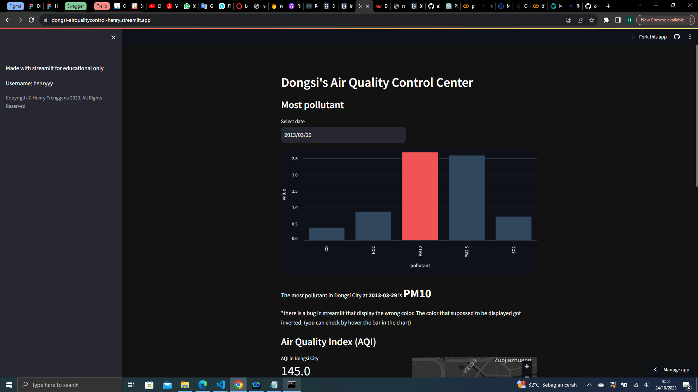
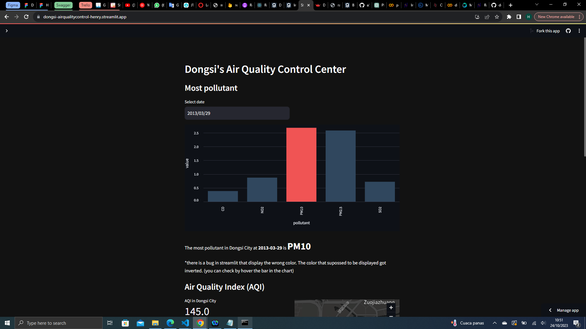
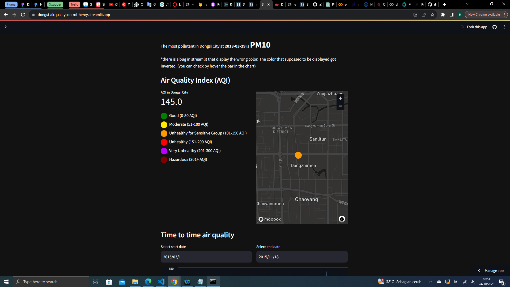
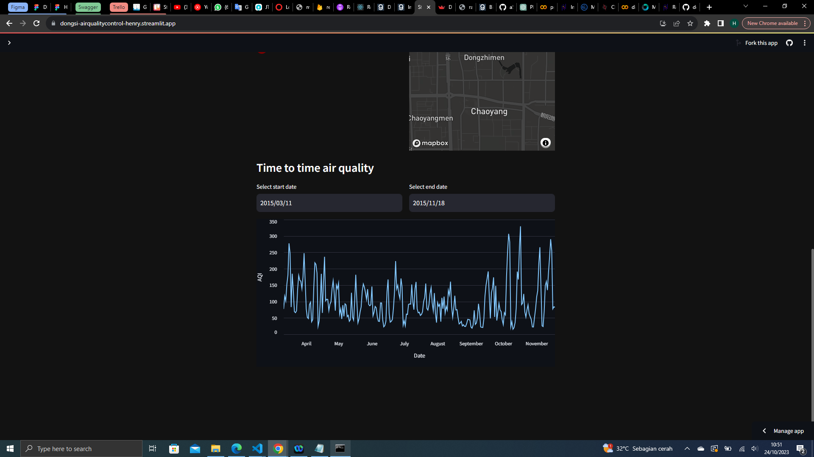

# Dongsi's Air Quality Control Center

## Setup environment

```
pip install -r requirements.txt
```

or

```
pip install matplotlib pandas streamlit
```

## Run Streamlit app

```
cd dashboard
streamlit run dashboard.py
```

### If you don't want to run in your local environment you can see the demo page in https://dongsi-airqualitycontrol-henry.streamlit.app/

### This app have sidebar contain my information



### First chart, visualize the most pollutant in filtered day



### There is also a map chart to visualize the condition of Dongsi City with AQI



### Last, there is the chart that visualize the AQI from time to time


